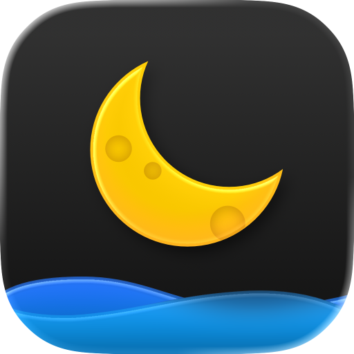
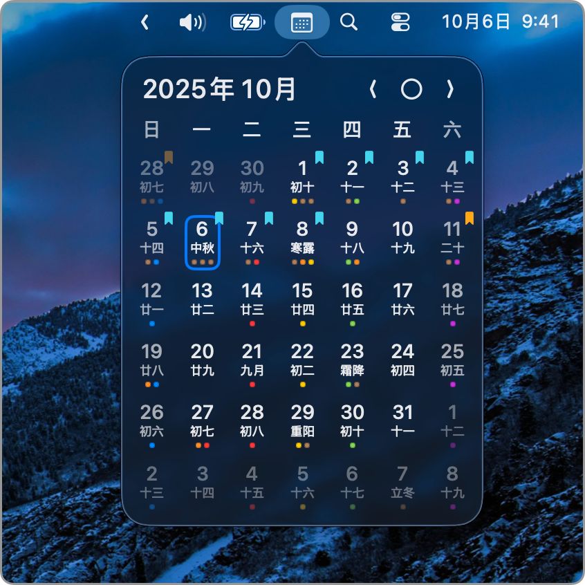
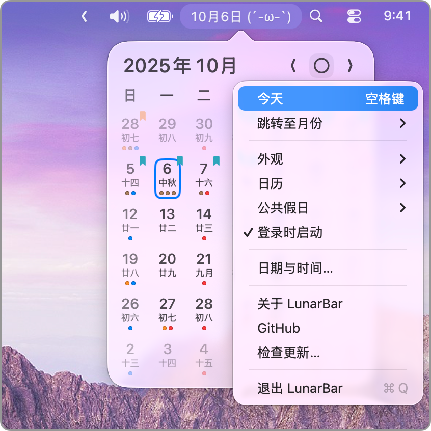
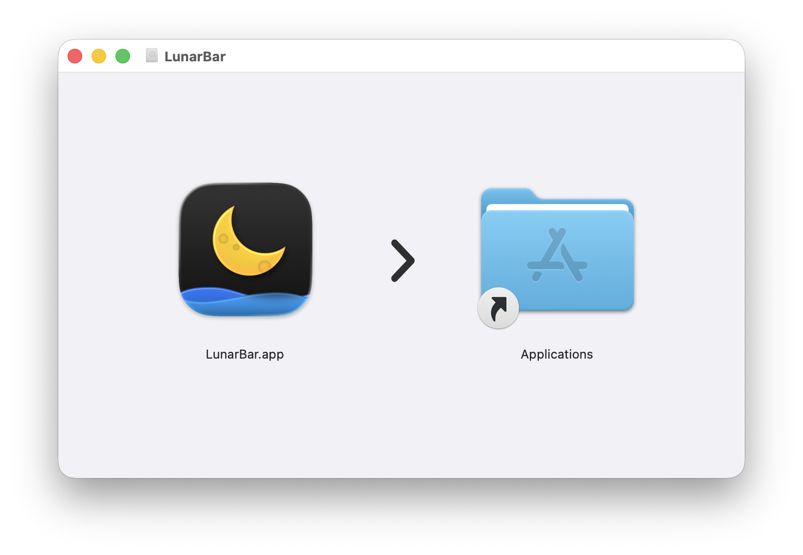

# LunarBar

 

Mac 状态栏上的极简日历，完全免费且开源。

 

## 安装 LunarBar

从 <a href="https://github.com/LunarBar-app/LunarBar/releases/latest" target="_blank">latest release</a> 获取 `LunarBar.dmg`，打开后将 `LunarBar.app` 拖拽至 `Applications` 即可。

> LunarBar 会自动检查更新，你也可以在应用内手动检查更新，或者在 [releases](https://github.com/LunarBar-app/LunarBar/releases) 页面浏览历史版本。

## 使用 LunarBar 的理由

如果你是这类人，欢迎试试：

- 日常使用 Mac
- 需要查看阴历
- 需要查看公共假日
- 喜欢极致的应用
- 喜欢简单的事物

请不要期待过高，LunarBar 的极简设计是经过深思熟虑的结果。当它不能满足你的期待时，不妨试试其他产品。

## 一些可能被问到的问题

本项目没有设立反馈渠道，所以在此解释一些常见问题。

**为什么开发 LunarBar**

我们开发它纯粹是为了满足自己的需求，将它发布也只是以防万一你也需要。

**为什么不开发 iOS 版本**

我们没有这个需求，iOS 没有状态栏，且通知中心小组件已被废弃。

**为什么不开发小组件版本**

基于 SwiftUI 的“新”小组件即便到了 2024 年也不够完善，我们不想做。

**LunarBar 是怎么开发的**

如果你作为开发者对 LunarBar 的开发过程感兴趣，请参考[这篇文章](./DEV.md)。
